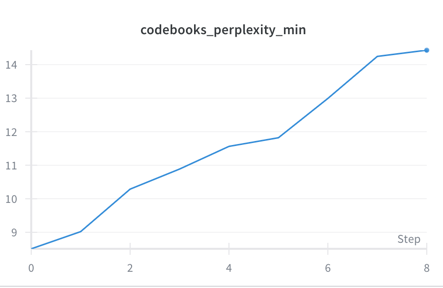

# ResidualVQVAE with ResNet50 backbone for Image Reconstruction

[](https://huggingface.co/detker/res-vqvae-net50-48M)


<p align="center"><i>Simplified architecture of ResVQVAENet</i></p>
<br>


## 📋 Table of Contents

- [Introduction](#introduction)
- [Setup](#setup)
- [Training](#training)
- [Notebooks](#notebooks)

## 🔎 Introduction

This repository implements a convolutional residual VQ-VAE model with ResNet50 backbone for image reconstruction tasks. The project leverages PyTorch, `accelerate`, and other modern libraries for efficient training and evaluation.

### Highlights
- **Image Reconstruction**: Designed for high-quality image reconstruction tasks.
- **Customizable Training**: Easily modify hyperparameters and configurations.
- **Distributed Data Parallelism**: Training can be performed on a multi-GPU setup using the `accelerate` library.
- **Ready-to-Go Inference**: Supports loading model through Hugging Face's `transformers` library

### 📂 Project Structure
```
├── src/
├── inference/
├── imgs/
├── wandb/
├── data/
│   ├── train/
│   └── test/
├── working_directory/
│   └── experiment_name/
│       └── checkpoints/
```

### 📦 Model Weights
Pretrained model weights are available on Hugging Face: [ResVQVAE Weights](https://huggingface.co/detker/res-vqvae-net50-48M)

You can load the model using Hugging Face's `AutoModel` and `AutoConfig` classes:

```python
from transformers import AutoModel, AutoConfig
from inference.hf_pretrained_model import ResVQVAEResNet50Config, ResVQVAEResNet50

# Register model
AutoConfig.register('res-vqvae-net50', ResVQVAEResNet50Config)
AutoModel.register(ResVQVAEResNet50Config, ResVQVAEResNet50)

# Load the model
model = AutoModel.from_pretrained('detker/res-vqvae-net50-xM',
                                  trust_remote_code=True)

# Example usage
inputs = ...  # Prepare your input tensor
outputs = model(inputs)
```

## ⚙️ Setup

### Prerequisites
Ensure the following dependencies are installed:
- Python 3.11.4
- Conda 23.7.3
- PyTorch (compatible with your hardware)

### Installation
Clone the repository and set up the environment:
```bash
git clone https://github.com/detker/ResVQVAENet
cd ResVQVAENet
conda create -n resvqvae python=3.11.4
conda activate resvqvae
pip install -r requirements.txt
```

#### Dataset Preparation
Download the ImageNet100 dataset (subset of ImageNet) and organize it into `train` and `test` folders. Use the provided `download_imagenet_subset.sh` script to automate the process:

```bash
chmod +x download_data.sh
./download_data.sh
```

Downloading the entire ImageNet-1k dataset is possible (by launching `download_imagenet.sh`), but the model was trained on the ImageNet100 subset, and its performance on the full dataset remains untested.

## 🚀 Training
The available weights were obtained by training on 4xRTX 4090 GPUs using DDP techniques for 10 epochs. The batch size was relatively small due to VRAM constraints caused by the 224x224 image size.  
For inference, we use the EMA (Exponential Moving Average) model.  
Possible improvements include:  
+ Reducing codebook collapse
+ Replacing ResNet50 with a more advanced backbone  
+ Training on the entire ImageNet dataset  
+ Lowering the commitment loss weight  
+ Implementing **Gumbel Softmax Quantization** (differentiable discrete sampling would help gradient flow during backprop through non-differentiable argmin operator)

Below is the loss visualization taken from the wandb platform.  





Train the model using the `train_base.sh` script. Adjust the parameters in the script as needed. Example:
```bash
chmod +x train_base.sh
./train_base.sh
```

Training parameters include:

| Parameter                     | Description                                              | Default Value | Type       |
|-------------------------------|----------------------------------------------------------|---------------|------------|
| `--experiment_name`           | Name of the experiment being launched                    | **Required**  | `str`      |
| `--working_directory`         | Directory where checkpoints and logs are stored          | **Required**  | `str`      |
| `--path_to_data`              | Path to the dataset root folder                          | **Required**  | `str`      |
| `--checkpoint_dir`            | Directory for saving checkpoints                         | **Required**  | `str`      |
| `--max_grad_norm`             | Maximum norm for gradient clipping                       | `1.0`         | `float`    |
| `--per_gpu_batch_size`        | Batch size per GPU                                       | `8`           | `int`      |
| `--gradient_accumulation_steps`| Number of gradient accumulation steps                    | `4`           | `int`      |
| `--warmup_epochs`             | Number of warmup epochs                                  | `3`           | `int`      |
| `--epochs`                    | Total number of training epochs                          | `200`         | `int`      |
| `--save_checkpoint_interval`  | Interval (in epochs) to save checkpoints                 | `1`           | `int`      |
| `--learning_rate`             | Maximum learning rate for the cosine scheduler           | `3e-4`        | `float`    |
| `--weight_decay`              | Weight decay value (excluding BN, Embeddings, Biases)    | `0.1`         | `float`    |
| `--adam_beta1`                | Beta1 parameter for the AdamW optimizer                  | `0.9`         | `float`    |
| `--adam_beta2`                | Beta2 parameter for the AdamW optimizer                  | `0.98`        | `float`    |
| `--adam_epsilon`              | Epsilon parameter for the AdamW optimizer                | `1e-6`        | `float`    |
| `--commitment_loss_beta`      | Weight for the commitment loss                           | `0.25`        | `float`    |
| `--ema_decay`                 | Exponential moving average (EMA) decay value             | `0.999`       | `float`    |
| `--max_no_of_checkpoints`     | Maximum number of checkpoints to store                   | `5`           | `int`      |
| `--img_size`                  | Width and height of input images                         | `224`         | `int`      |
| `--in_channels`               | Number of channels in the input image                    | `3`           | `int`      |
| `--num_workers`               | Number of workers for the DataLoader                     | `5`           | `int`      |
| `--custom_weight_init`        | Whether to initialize model weights with truncated/kaiming normal | Enabled       | `bool`     |
| `--perceptual_loss_lambda`    | Weight for the perceptual loss                           | `1e-3`        | `float`    |
| `--use_perceptual_loss`       | Whether to use additional perceptual loss                | Enabled       | `bool`     |
| `--resume_from_checkpoint`    | Path to the checkpoint to resume training from           | `checkpoint_8` | `str`      |
| `--log_wandb`                 | Whether to log metrics to Weights & Biases               | Enabled       | `bool`     |

NOTE: This repo also implements ResVQVAE with `ResNet{101,150}` architectures, but the performance remains untested.

Checkpoints are saved periodically in the `{working_directory}/{experiment_name}/{checkpoint_dir}` directory.

## 🧪 Notebooks 

Explore the `inference/` directory for a quick inference demo.

The animation below illustrates the process of adding random noise, sampled from a Gaussian distribution, to the latent.
<p align="center">
  <br>
  <i>Image: Distorted man</i>
</p>